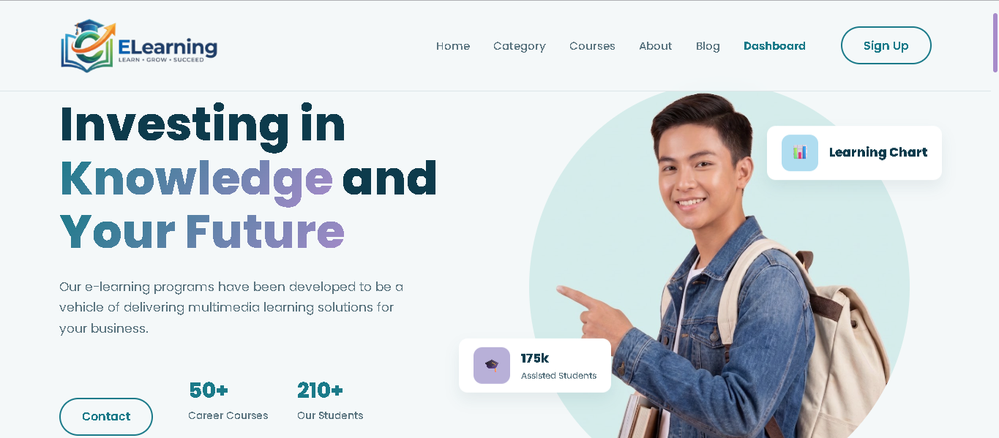

# E-Learning Platform - Premium Education UI 🚀

1. Home Page Preview
 

  

2. User Dashboard Preview
 

  

3. Blog Preview
 

  

Welcome to the E-Learning Platform, a modern, highly interactive, and fully responsive frontend architecture designed for digital education and skill-building. This project focuses on delivering a seamless and premium User Experience (UX) through robust client-side logic, data persistence, and smooth UI interactions. Developed as Task 2 during the Frontend Developer Internship at Hex Softwares Pvt. Ltd.

### 📑 Project Details & In-Depth Features

**1. Advanced Client-Side Authentication**
* **Local Storage Integration:** A complete Sign Up and Log In system built entirely on the frontend. User data (Name, Email, Password) and active session tokens are securely saved and retrieved from the browser's Local Storage.
* **Smart Dynamic Navbar:** The navigation bar intelligently checks the login state across *all* pages (Home, Category, Course, Blog, About). If a session is active, the generic "Sign Up" button is instantly swapped out for the user's actual first name (e.g., 👤 Name), providing a highly personalized app-like feel.

**2. Protected Dashboard & Routing**
* **Route Security:** The User Dashboard (`dashboard.html`) is strictly protected by JavaScript validation. If a user tries to access it without a valid Local Storage session, they are immediately redirected back to the Home page.
* **Personalized User Area:** Once logged in, the dashboard dynamically fetches the user's data from Local Storage to display a personalized welcome message and tailored learning options.

**3. Real-Time Search & Data Filtering**
* **Dynamic Category Search:** The Category page features a highly responsive search bar. As the user types, Vanilla JavaScript instantly filters through course titles and descriptions.
* **"No Results" State:** If a user searches for a query that doesn't exist, a custom "Oops! No categories found matching your search" message elegantly appears instead of leaving a broken or blank screen.

**4. Interactive UI & Custom Theming**
* **Custom Teal & Purple Theme:** A meticulously designed color palette utilizing CSS variables (`--bg-main`, `--accent-primary`) for a consistent, premium look across all components.
* **Custom Scrollbars:** Replaced the default browser scrollbar with a sleek, custom-styled WebKit scrollbar that perfectly matches the website's Teal/Purple aesthetics.
* **Full-Screen Modals:** Instead of redirecting to new pages, clicking on courses or pricing plans triggers smooth, full-screen interactive modals that fetch details dynamically without reloading the page.

### 🛠️ Tech Stack
This dynamic platform is built entirely without heavy external frameworks to ensure optimal performance and demonstrate core frontend engineering skills:
* **HTML5:** Semantic structure, accessibility, and clean DOM hierarchy.
* **CSS3:** Custom CSS variables, Flexbox & Grid layouts, hover animations, responsive media queries, and WebKit custom scrollbars.
* **Vanilla JavaScript (ES6+):** DOM manipulation, Local Storage API management, event listeners, cross-page dynamic navbar rendering, and real-time search logic.

### 👨‍💻 Developed By

**Muhammad Zohaib Ikram**
*BSc CS Graduate | Frontend Developer | Android Developer|#vibecoder#*
Dedicated to writing clean, scalable code and building user interfaces that look professional and feel incredibly smooth to interact with.
